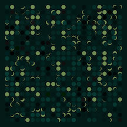
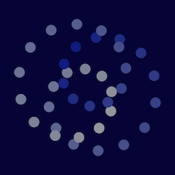

[](https://github.com/code-not-art/sketch/blob/main/LICENSE) [](https://www.npmjs.com/package/@code-not-art/sketch) [](https://www.typescriptlang.org/)
# Sketch Framework

Framework used to create generative art using pseudo-random and parametric algorithms. This library provides a hot reloading canvas to simplify developer workflow for art development. This is the developer interface for creating art using the tools provided by the [@code-not-art/core](https://github.com/code-not-art/core) canvas drawing library.

This code base provides a demo environment usable for art development, included as a mechanism to test changes to the web component package. This demo setup is used as the foundation for [@code-not-art/template](https://github.com/code-not-art/template) which provides a blank canvas to easily make your own generative works. 

*If you are looking to write some code that makes some art, [head over there](https://github.com/code-not-art/template) to get started immediately.*


## Running the Demo (Quick Start)

This repository is managed with [pnpm](https://pnpm.io/). The following commands will probably work with your preferred package manager (by replacing `pnpm` in these commands with `npm` or `yarn`, as you prefer. 

> Note for Contributers: If submitting changes with with updated dependencies, please install these with pnpm and provide the generated updates for the `pnpm-lock.yaml` file.

1. **Clone** to your computer - [How To](https://docs.github.com/en/desktop/contributing-and-collaborating-using-github-desktop/adding-and-cloning-repositories/cloning-a-repository-from-github-to-github-desktop)

1. Install dependencies with pnpm:

   ```
   pnpm i
   ```

1. Start development server:

   ```
   pnpm start
   ```

   The server will run on `localhost:1234`.

1. The page will render the sketch defined in [`src/demos/basic.ts`](./src/demos/basic.ts). Open this file your editor of choice and write your sketch there. The server will watch for changes to the file, drawing to the canvas on the browser whenever you save your work.

> Other demo sketches to play with are in that demos folder, but need to be imported into `src/demo.tsx` and passed as a prop into the `App` element.

## Sketch Web Interface Controls

| **Key** |                                      **Action**                                       |
| :-----: | :-----------------------------------------------------------------------------------: |
|   `s`   |                              **Save** the current image                               |
|   `u`   | Shareable image **URL** - Create a shareable URL and copy that link to your clipboard |
|   `m`   |                             Show/Hide Parameter **Menu**                              |
|         |                                                                                       |
| `space` |                 Draw **new image** with random image and color seeds.                 |
|   `↑`   | Move to **next color** seed, or generate a new one if at end of list. Draw new image. |
|   `↓`   |                   Move to **previous color** seed. Draw new image.                    |
|   `→`   | Move to **next image** seed, or generate a new one if at end of list. Draw new image. |
|   `←`   |                   Move to **previous image** seed. Draw new image.                    |
|   `c`   |                     Generate new **color** seed. Draw new image.                      |
|   `i`   |                     Generate new **image** seed. Draw new image.                      |

## The Sketch Interface (AKA. how to code your sketch)

The canvas expects a prop of the [`Sketch`](src/sketch/Sketch.ts) type. This interface allows you to provide configuration details for your sketch (`config`), and interactable parameters that you can update in browser (`params`). There are several methods for available for you to implement that will interact with the canvas and the seeded random generators provided by the framework. The only one of these that are absolutely required to provide is the `draw(props)` method, all others have sensible (mostly empty) defaults.


|       **Property**       |                                                 **Type**                                                  | **Required** |                                                                                                       **Description**                                                                                                       |                                                              **Default**                                                              |
| :----------------------: | :-------------------------------------------------------------------------------------------------------: | :----------: | :-------------------------------------------------------------------------------------------------------------------------------------------------------------------------------------------------------------------------: | :-----------------------------------------------------------------------------------------------------------------------------------: |
|         `config`         |                         JSON matching type [`ConfigInput`](src/sketch/Config.ts)                          |      No      |                                                                                 Configure image and project properties such as canvas size.                                                                                 | <b>Image size:</b> 1080x1080<br/><b>Color and Palette seeds:</b> Random Seeds based on current date and time<br/><b>FrameRate:</b> 60 |
|         `params`         |                                       An array of `Param` objects.                                        |      No      |                                                                       Adds to the browser menu list of adjustable parameters that control the sketch.                                                                       |                                                       No interactive parameters                                                       |
|      `init(props)`       |                       Function providing [`SketchProps`](src/sketch/SketchProps.ts)                       |      No      | Runs when sketch is first passed to the [`Canvas`](https://github.com/code-not-art/core/blob/main/src/canvas/index.ts) allowing for expensive up front work to be done once and not repeated when new images are generated. |                                                       No operations performed.                                                        |
|      `reset(props)`      |                       Function providing [`SketchProps`](src/sketch/SketchProps.ts)                       |      No      |                                                            Runs when user requests a new image to be drawn. Use this to reset any data as needed between draws.                                                             |                                          Clears the canvas back to empty (all transparent).                                           |
|      `draw(props)`       |                       Function providing [`SketchProps`](src/sketch/SketchProps.ts)                       |   **Yes**    |                                    The main drawing actions of the sketch. This will be run once whenever a user requests a new image to be generated.                                    |                                                                   -                                                                   |
| `loop(props, frameData)` | Function providing [`SketchProps`](src/sketch/SketchProps.ts) and [`FrameData`](src/sketch/FrameData.ts). |      No      |                                        Will be called every frame of the animation loop controlled by the page. The framerate will attempt to match the value specified in `config`. The loop will stop once this function returns `true` (indicating the animation has finished).                                        |                                                       No operations performed.                                                        |

### SketchProps

The [`SketchProps`](src/sketch/SketchProps.ts) are provided provided to every function in the Sketch definition. They provide access to the `Canvas`, and to the seeded `Random` generators. The full list of properties available and links to their code or documentation is:

| **Property** |                                             **Type**                                              |                                                                                                                   **Description**                                                                                                                   |
| :----------: | :-----------------------------------------------------------------------------------------------: | :-------------------------------------------------------------------------------------------------------------------------------------------------------------------------------------------------------------------------------------------------: |
|    canvas    | [`@code-not-art/core.Canvas`](https://github.com/code-not-art/core/blob/main/src/canvas/index.ts) |                                       Provides access to the canvas and 2D context directly, plus all the drawing tools provided by the [`code-not-art core library`](https://github.com/code-not-art/core).                                        |
|     rng      | [`@code-not-art/core.Random`](https://github.com/code-not-art/core/blob/main/src/random/index.ts) |                                                                                                 Random number generator provided the **image** seed                                                                                                 |
|   palette    |                             [`Palette`](src/sketch/Palette/index.ts)                              |                 Random Color Palette with 5 randomly selected colors. Changing the color seed will update the colors in the palette without affecting the random seed of the `rng` `Random` generator provided in the `SketchProps`                 |
|    params    |                                         `StringMap<any>`                                          |                                                The values for the parameters provided in the sketch definition. If these are updated in the UI then this params object will have the updated values.                                                |

### Example Sketch Code

This repository provides a folder with example Sketch files that can be rendered and edited live with the Sketch web components. These demos are located at [./src/demos](./src/demos/).

Each sketch file exports a `Sketch` object. Building this object requires us to prepare a function for each of the Sketch lifecycle stages, as well as define the controls we want to be available for our sketch.

| File | Description | Example |
| ---- | ---- | --- |
| [basic.tsx](./src/demos/basic.ts) | Grid of shapes with minor variation. Demonstrates several of the available control menu parameter types, as well as how to use canvas transforms and the rng stack to maintain pseudo-random consistency as parameters change. |  |
| [basic2.tsx](./src/demos/basic2.ts) | Grid of circles with randomly positioned masks. Another very simple drawing included to show use of the randomly generated color palette. |  |
| [loop.tsx](./src/demos/loop.ts) | Circles rotating in a spiral. Example demonstrating simple animation through the `loop` function. Control panel can set the update speed. |  |


> [!TIP]
> Since creating a new sketch like these involves writing quite a bit of boilerplate, it is recommended to copy the template sketch located at [./src/demos/template.ts](./src/demos/template.ts) to use for writing your own sketches.
