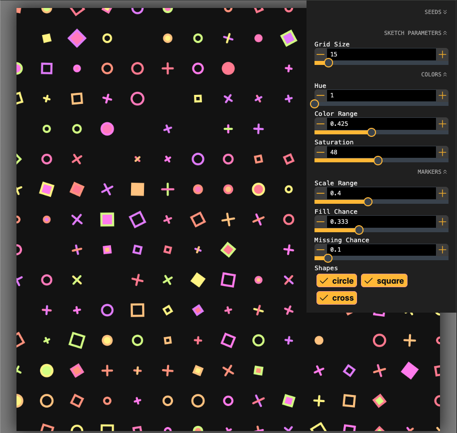
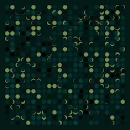
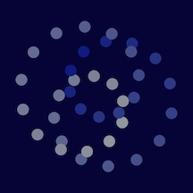

# Make Code Not Art - Demos

This application provides an example application to usable for developers to run integration tests of the contained packages, as well as a runnable demonstration of some simple example Sketches.

It is very similar to [@code-not-art/template](https://github.com/code-not-art/template) which provides a blank canvas to easily make your own generative works.

_If you are looking to write some code that makes some art, [head over there](https://github.com/code-not-art/template) to get started immediately._



## Using the Application

Run the application locally using the `dev` script:

```shell
pnpm dev
```

When this run succeeds, a console message will indicate the URL to access the demo application in your browser. By default, this will be at `http://localhost:5173`.

This will run [vite](https://vite.dev/)'s web server with hot reloading enabled, along with an [`nx watch`](https://nx.dev/nx-api/nx/documents/watch#watch) command which will reload dependencies whenever they are rebuilt.

You can use this to test changes to the `core` and `sketch` libraries, by rebuilding those libraries in teh command line, the demo app will immediately reload using the updated build of those packages.

### Pre-bundled Sketches

Sketch files are found in [`./src/demos`](./src/demos)

Each sketch file exports a `Sketch` object. Each sketch object includes a function for each stage of the sketch lifecycle and a set of parameters that can be controlled to control the image generation algorithm - see the [sketch](../../packages/sketch) package for more details.

| File                                | Description                                                                                                                                                                                                                    | Example                                                                        |
| ----------------------------------- | ------------------------------------------------------------------------------------------------------------------------------------------------------------------------------------------------------------------------------ | ------------------------------------------------------------------------------ |
| [basic.tsx](./src/demos/basic.ts)   | Grid of shapes with minor variation. Demonstrates several of the available control menu parameter types, as well as how to use canvas transforms and the rng stack to maintain pseudo-random consistency as parameters change. |    |
| [basic2.tsx](./src/demos/basic2.ts) | Grid of circles with randomly positioned masks. Another very simple drawing included to show use of the randomly generated color palette.                                                                                      |  |
| [loop.tsx](./src/demos/loop.ts)     | Circles rotating in a spiral. Example demonstrating simple animation through the `loop` function. Control panel can set the update speed.                                                                                      |      |

> [!TIP]
> Since creating a new sketch like these involves writing quite a bit of boilerplate, it is recommended to copy the template sketch located at [./src/demos/template.ts](./src/demos/template.ts) to use for writing your own sketches.

### Switch Demo Sketches

This application has a few bundled sketches that you can run, they are all available in [./apps/demos/src/demos](./apps/demos/src/demos). The app will only run one sketch at a time, and this selection is hardcoded into the file [./apps/demos/src/App.tsx](./apps/demos/src/App.tsx). To change which sketch is rendered, update the `import sketch` statment to point to the sketch file you want to run. If you are running the demo script, after saving the `App.tsx` file the browser will update to render the new sketch.

Example:

```ts
// Render loop.ts instead of basic.ts
import sketch from './demos/loop.js';
```

Note:

The file [`template.ts`](./src/demos/template.ts) is a valid sketch, but contains no interesting content. You can use it in the app but it won't be very exciting. Consider instead copying it into a file of your own and add something interesting :)
