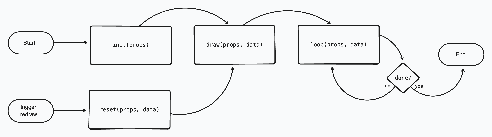

# `SketchDefinition` Type Definition

> The `SketchDefinition` type is defined in the file [`src/sketch/Sketch.ts`](../src/sketch/Sketch.ts).

A `SketchDefinition` describes a procedurally generated art algorithm. It includes the functions to execute the drawing on an HTML canvas, as well as the parameters that can be used by an artist to control and vary the output of the algorithm.

Since a full `SketchDefinition` has many properties, and these are not always needed, a function `createSketch()` is exported form the same file as the `SketchDefinition` which makes most properties of the `SketchDefiniton` optional, replacing them with default values that will not interfere with the defined sketch.

## Definition

A `SketchDefinition` is defined by a configuration object, a definition of the parameters that control the Sketch's algorithm, and four functions that define each of the phases in the [Sketch lifecycle](#sketch-lifecycle) phases.

### Sketch Lifecycle

The `Sketch` definition is setup to be drawn repeatedly. Redraws are typically triggered when the input parameters or pseudo-random seeds are updated by the user. This allows an artist or viewer to investigate how the same algorithm changes on multiple renders or with different parameter values.

In order to facilitate this, the `SketchDefinition` is split into 4 distinct phases. Each of these phases has a function that is executed. They are run in sequence, as described in the following diagram.



#### 1. `init`

Initialize sketch data.

Runs only once. The `init` function is given access to the canvas and other sketch properties, but no initial data state. It is the responsibilit of the `init` function to return the initial data state for the Sketch. that will be referenced and updated during the `draw` and `loop` stages. This is only called once ever, on redraws the `reset` function is called instead. If there are any slow running calculations used by the algorithm, this is the best place to perform this work for reuse by future phases of the sketch. You can draw on the canvas here - as in all phases - but be remember that this will only occur on the first iteration of the Sketch, and not be repeated when a redraw is triggered.

#### 2. `draw`

Draw the image.

This is run one time, before the `loop` phase begins to draw frame by frame. If you want to draw a background that the loop will iterate on top of, this is a good place to run that one time canvas drawing function.

**Returns:** `void` Nothing is returned.

**Data Mutation:** The `data` object from the function arguments is mutable, and any changes to the data will be persisted into the next frame.

#### 3. `loop`

Executed once per frame of the animation loop.

This function draws on top of the canvas after the `draw` phase, and is repeated until the function returns `true` to indicate that it is done. The canvas is not cleared between frames, so the loop can draw on top of the previous state.

**Returns:** `boolean` indicating whether the loop is done. If `true`, this is the final frame. if `false`, the `loop` function will be called for another frame.

**Data Mutation:** The `data` object from the function arguments is mutable, and any changes to the data will be persisted into the next frame.

#### 4. `reset`

Called to reset the Sketch when a redraw is triggered. This function returns the sketch data to use by the `draw` phase as it redraws the canvas. Note that the canvas is not cleared automatically. It is up to the Sketch if the canvas should be cleared or drawn over before starting again.

**Returns:** `SketchData`

**Data Mutation:** The `data` object from the function arguments is mutable, and any changes to the data will be persisted into the next frame.

### SketchDefinition Generic Types

Each `SketchDefinition` is customized by the type of its input parameters (`SketchParameters`) and the data model that is persisted between frames of the Sketch animation loop (`SketchData`). The full type declaration can be infered to be like.

Utility types have been exported so that, given a `Sketch`, the type of the `SketchParameters` and the `SketchData` can be extracted.

#### SketchParameters

#### SketchConfig

> `SketchConfig` type is defined as the `ReturnType` of the function `createSketchConfig()`. These are both exported from the file [`src/sketch/Config.ts`](../src/sketch/Config.ts).

This object includes various options for configuring the image that the `Sketch` will generate.

| Property               | Type          | Default                                        | Description                                                                                                                                                                                                                                                                                                                                                                                                                     |
| ---------------------- | ------------- | ---------------------------------------------- | ------------------------------------------------------------------------------------------------------------------------------------------------------------------------------------------------------------------------------------------------------------------------------------------------------------------------------------------------------------------------------------------------------------------------------- |
| **height**             | `number`      | `1080` (pixels)                                | Height, in pixels, of the generated image. <br/>Note: This is not the display size of the canvas, this sets the resolution of the generated image.                                                                                                                                                                                                                                                                              |
| **width**              | `number`      | `1080` (pixels)                                | Width, in pixels, of the generated image. <br/>Note: This is not the display size of the canvas, this sets the resolution of the generated image.                                                                                                                                                                                                                                                                               |
| **seed**               | `string`      | Current Date and Time, as ISO formatted string | Used to initialize the pseudo-random number generators that are provided to the Sketch. <br/>Note: This is used to generate two Random generators, one for the image pattern, and one for the color palette. These Random generators can also be given their own specific seeds to overwrite the one created by this seed property.                                                                                             |
| **menuDelay**          | `number`      | `25` (miliseconds)                             | When the control panel is rendered, this is the time delay between making an update and triggering a redraw of the Sketch. Set a higher value here if the Sketch is slow to draw, so that a user hasmore time for fine adjustment of sliders before the new Sketch begins.                                                                                                                                                      |
| enableImageControls    | `boolean`     | `true`                                         | Enable or disable the keyboard shortcuts for updating image seeds.<br/>Note: This may be overriden by the UI component rendering the Sketch.                                                                                                                                                                                                                                                                                    |
| **enableLoopControls** | `boolean`     | `false`                                        | Enable or disable the keyboard shortcuts for controlling animation loop.<br/>Note: This may be overriden by the UI component rendering the Sketch.                                                                                                                                                                                                                                                                              |
| **paletteType**        | `PaletteType` | `PaletteType.Random`                           | Every sketch is provided a randomized color palette, consisting of 5 colors. There are two built in methods to generate these palettes, `Random` and `Curated`. A `Random` pallete will have 5 completely randomly generated colors. A `Curated` palette retrieves one of 1000 popular user generated palettes from `colourlovers.com` (See [nice-color-palettes](https://www.npmjs.com/package/nice-color-palettes) on npmjs). |

### SketchProps

Each of the lifecycle functions is pased a `props` object which contains this `SketchProps` object. This contains several resources that are initialized by the `SketchController` an persisted between Sketch lifecycles, such as a seeded pseudo-random generator, and the `SketchParameter` values. Importantly, these props include access to the [Canvas](https://github.com/code-not-art/core/tree/main/docs/Canvas.md) object that provides access to the HTML canvas for the Sketch.

| Properties | Type Reference                                                          | Description                                                                                                                                                                                                                                                                                                                                                                                                                          |
| ---------- | ----------------------------------------------------------------------- | ------------------------------------------------------------------------------------------------------------------------------------------------------------------------------------------------------------------------------------------------------------------------------------------------------------------------------------------------------------------------------------------------------------------------------------ |
| canvas     | [Canvas](https://github.com/code-not-art/core/tree/main/docs/Canvas.md) | Provides access to the HTML canvas that you can draw on. There are many convenience functions provided here for drawing common shapes (`canvas.draw`) and for fetching properties of the canvas being drawn on (`canvas.get`). This object also includes access to the canvas context (`canvas.context`) if you want to use the [context2d API](https://developer.mozilla.org/en-US/docs/Web/API/CanvasRenderingContext2D) directly. |
| palette    | [Palette](./palettes.md)                                                | A set of 5 random colors that can be used to define the colors used in the sketch.                                                                                                                                                                                                                                                                                                                                                   |
| params     | [SketchParams](#sketchparameters)                                       | The input parameters that will be used in the sketch algorithm.                                                                                                                                                                                                                                                                                                                                                                      |
| rng        | [Random](https://github.com/code-not-art/core/tree/main/docs/Random.md) | A pseudo random number generator that can be used to generate random values used in the sketch algorithm.                                                                                                                                                                                                                                                                                                                            |

## Usage

In this section we will define a new Sketch, from scratch, so that we can render it in a `SketchCanvas` component.

If you want to jump right into some code that has all the boilerplate prepared, take a loook at the [`template.ts` demo sketch file](../src/demos/template.ts).

### Create a Sketch using `createSketch()`

We can create a SketchDefinition using the function `createSketch()` exported from [`src/sketch/Sketch.ts`](../src/sketch/Sketch.ts).

This function helps provide default values to most of the `SketchConfig` properties and `SketchDefinition` lifecycle functions, allowing the author to only provide only the properties that are necessary for their sketch algorithm.

The following steps will walk us through creating a sketch from scratch. This sketch will be a very minimal example that will create a simple particle spray animation. This sketch was chosen so that we could demonstrate basic usage of many of the Sketch features, notably:

1.  `SketchParameters` controls
2.  All four lifecyle functions
3.  `DataModel` persisting between animation frames
4.  Randomly generated color `Palette`
5.  Pseudorandom number generator

#### 1. Create Minimal Compiling Skech

Every sketch is defined by a set of `SketchParameters` that define it, and a DataModel that is persisted between frames in the drawing's animation loop, therefore there are two properties that every sketch absolutely requires: `controls` to define the parameters, and `init` which returns the initial data model. All other properties, defining the sketch config and all other lifecycle functions, are optional.

The following is the most basic sketch definition, creating a sketch that does nothing to the canvas. This will be the starting point that we build from in this section:

```ts
import { createSketch } from '@code-not-art/sketch';

const exampleSketch = createSketch({
	controls: {},
	init: () => ({}),
});
```

This will create a `SketchDefinition<{}, {}>`. The two generic types represent the `SketchParameters` and `DataModel` respectively. Since our `init` function returns an empty object, the `DataModel` is inferred as `{}`. Similarly, we provide an empty object for our parameter controls, so the `SketchParameter` model is also inferred as `{}`.

#### Drawing Something

To have our sketch draw something, we need to provide a `draw` function. The draw function has the type `SketchDraw<SketchParameters, DataModel>`, the definition for which can be found in [`src/sketch/Sketch.ts`](../src/sketch/Sketch.ts).

When we define this function, we get access to two properties, the current sketch data state, and a set of props that include the sketch's canvas, parameter values, random number generator, and palette. In this function, we can use the provided canvas to execute any number of commands to draw to the canvas.

The draw function does not return any value.

We can declare the type of our draw function usng the `SketchDraw` type so that TypeScript can give us useful type hinting:

```ts
import { type SketchDraw } from '@code-not-art/sketch';

const draw: SketchDraw<{}, {}> = (props, data) => {
	// TODO: Draw here...
};
```

Let's draw a background color over the entire canvas. We can use the first color in our provided [color palette](./palettes.md) as the background color, and then using the provided [Canvas](https://github.com/code-not-art/core/tree/main/docs/Canvas.md) we can use the `canvas.fill` method to set the color of the entire canvas:

```ts
import { createSketch, type SketchDraw } from '@code-not-art/sketch';

const draw: SketchDraw<{}, {}> = (props, data) => {
	const { canvas, palette } = props;

	const backgroundColor = palette.colors[0];

	canvas.fill(backgroundColor);
};

const exampleSketch = createSketch({
	controls: {},
	init: () => ({}),
	draw,
});
```
