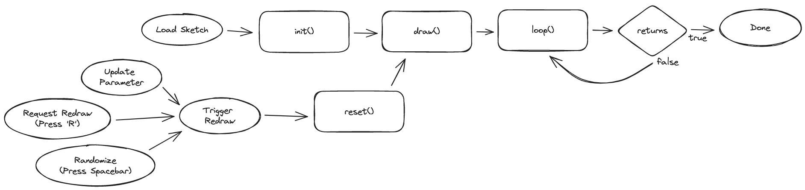

[](https://github.com/code-not-art/sketch/blob/main/LICENSE) [](https://www.npmjs.com/package/@code-not-art/sketch) [](https://www.typescriptlang.org/)

# Sketch Framework

Framework used to create generative art using pseudo-random and parametric algorithms. This library provides an interface for a `Sketch` object that defines a parameterized algorithm for generative artwork, and React components to run those `Sketch` algorithms and render them on an HTML canvas.

The primary use of this is to be used in an interactive development environment, where a coder can make changes to a `Sketch` and their browser will immediately render their updated algorithm.

In addition to this original purpose, the React components can be embedded into any website as a means to provide control over an HTML canvas, or to display a sketch in a (non-development) context.

## Sketch Web Interface Controls

The sketch controller provides keyboard shortcuts for controlling the development environment.

These are disabled by default to prevent hijacking keyboard commands outside of the sketch developer use case.

| **Key** |                                      **Action**                                       |
| :-----: | :-----------------------------------------------------------------------------------: |
|   `s`   |                              **Save** the current image                               |
|   `u`   | Shareable image **URL** - Create a shareable URL and copy that link to your clipboard |
|   `m`   |                             Show/Hide Parameter **Menu**                              |
|         |                                                                                       |
| `space` |                 Draw **new image** with random image and color seeds.                 |
|   `↑`   | Move to **next color** seed, or generate a new one if at end of list. Draw new image. |
|   `↓`   |                   Move to **previous color** seed. Draw new image.                    |
|   `→`   | Move to **next image** seed, or generate a new one if at end of list. Draw new image. |
|   `←`   |                   Move to **previous image** seed. Draw new image.                    |
|   `c`   |                     Generate new **color** seed. Draw new image.                      |
|   `i`   |                     Generate new **image** seed. Draw new image.                      |

## The Sketch Interface and Lifecycle

The `SketchController` expects a prop of the [`Sketch`](src/sketch/Sketch.ts) type. This interface allows you to provide configuration details for your sketch (`config`), and interactable parameters that you can update in browser (`params`). There are several methods for available for you to implement that will interact with the canvas and the seeded random generators provided by the framework. The only one of these that are absolutely required to provide is the `draw(props)` method, all others have sensible (mostly empty) defaults.



|       **Property**       |                                                 **Type**                                                  | **Required** |                                                                                                                                                **Description**                                                                                                                                                 |                                                              **Default**                                                              |
| :----------------------: | :-------------------------------------------------------------------------------------------------------: | :----------: | :------------------------------------------------------------------------------------------------------------------------------------------------------------------------------------------------------------------------------------------------------------------------------------------------------------: | :-----------------------------------------------------------------------------------------------------------------------------------: |
|         `config`         |                         JSON matching type [`ConfigInput`](src/sketch/Config.ts)                          |      No      |                                                                                                                          Configure image and project properties such as canvas size.                                                                                                                           | <b>Image size:</b> 1080x1080<br/><b>Color and Palette seeds:</b> Random Seeds based on current date and time<br/><b>FrameRate:</b> 60 |
|        `controls`        |                                       An array of `Param` objects.                                        |   **Yes**    |                                                                                                   Defines the parameters that control the sketch. These are used to create the control panel for the sketch.                                                                                                   |                                                       No interactive parameters                                                       |
|      `init(props)`       |                       Function providing [`SketchProps`](src/sketch/SketchProps.ts)                       |   **Yes**    | Runs when sketch is first passed to the [`Canvas`](https://github.com/code-not-art/core/blob/main/src/canvas/index.ts) and is responsible for initializing the Sketch data model. This function is a good place to put expensive up front work to be done once and not repeated when new images are generated. |                                                       No operations performed.                                                        |
|      `reset(props)`      |                       Function providing [`SketchProps`](src/sketch/SketchProps.ts)                       |      No      |                                                                                                      Runs when user requests a new image to be drawn. Use this to reset any data as needed between draws.                                                                                                      |                                          Clears the canvas back to empty (all transparent).                                           |
|      `draw(props)`       |                       Function providing [`SketchProps`](src/sketch/SketchProps.ts)                       |      No      |                                                                                              The main drawing actions of the sketch. This will be run once whenever a user requests a new image to be generated.                                                                                               |                                                                   -                                                                   |
| `loop(props, frameData)` | Function providing [`SketchProps`](src/sketch/SketchProps.ts) and [`FrameData`](src/sketch/FrameData.ts). |      No      |                                  Will be called every frame of the animation loop controlled by the page. The framerate will attempt to match the value specified in `config`. The loop will stop once this function returns `true` (indicating the animation has finished).                                   |                                                       No operations performed.                                                        |

### SketchProps

The [`SketchProps`](src/sketch/SketchProps.ts) are provided provided to every function in the Sketch definition. They provide access to the `Canvas`, and to the seeded `Random` generators. The full list of properties available and links to their code or documentation is:

| **Property** |                                             **Type**                                              |                                                                                                   **Description**                                                                                                   |
| :----------: | :-----------------------------------------------------------------------------------------------: | :-----------------------------------------------------------------------------------------------------------------------------------------------------------------------------------------------------------------: |
|    canvas    | [`@code-not-art/core.Canvas`](https://github.com/code-not-art/core/blob/main/src/canvas/index.ts) |                       Provides access to the canvas and 2D context directly, plus all the drawing tools provided by the [`code-not-art core library`](https://github.com/code-not-art/core).                        |
|     rng      | [`@code-not-art/core.Random`](https://github.com/code-not-art/core/blob/main/src/random/index.ts) |                                                                                 Random number generator provided the **image** seed                                                                                 |
|   palette    |                             [`Palette`](src/sketch/Palette/index.ts)                              | Random Color Palette with 5 randomly selected colors. Changing the color seed will update the colors in the palette without affecting the random seed of the `rng` `Random` generator provided in the `SketchProps` |
|    params    |                                         `StringMap<any>`                                          |                                The values for the parameters provided in the sketch definition. If these are updated in the UI then this params object will have the updated values.                                |

### Example Sketch Code

This repository provides an application to run demonstration sketchs found at [/apps/demos](../../apps/demos/). These are a great place to start to look at implementing an example sketch.

The following is a bare minimum sketch. It does nothing but can be passed to a `SketchController` and will result in no changes to the canvas:

```ts
const bareMinimumSketch = createSketch({
	init: () => ({}),
	controls: {},
});
```

A sketch that will modify the canvas requires a `draw()` or `loop()` function. As a minimum example, the following sketch will completely fill canvas with a single color, using the first color from the provided palette:

```ts
const simpleSketch = createSketch({
	controls: {},
	init: () => ({}),
	draw: ({ canvas, palette }) => {
		canvas.fill(palette.colors[0]);
	},
});
```
